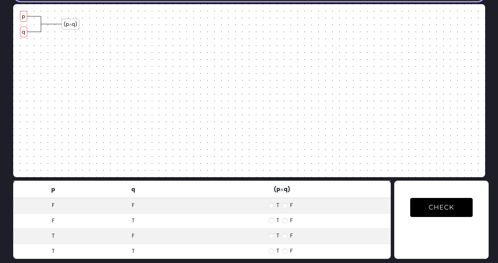
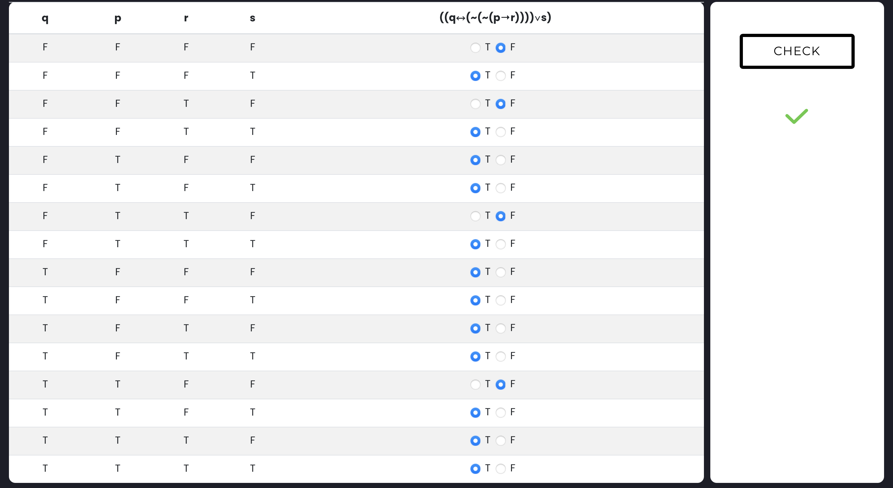

# BUAAlogic

## 介绍
北航数学科学学院-数理逻辑课程实验平台

## 静态网站
https://guolalala.github.io/buaalogic/

## 使用教程

下面以 命题演算- Problem1 为例，说明如何使用本平台（其实目前也只完成了 Problem1，不过其他的要弄也很快）

#### 问题描述

给出一个逻辑表达式，请利用变元和逻辑联结词构造此表达式，并填写正确的真值表

假如给出的表达式为 `p∧q`

#### 实验过程

* 在 `GENERATE` 按钮上方的 `input` 输入框中输入变元，如这里的就是 p 和 q
* 点击 `GENERATE` 按钮，生成

* 选择变元 p 和 q

**注意，点击矩形边框才能更好的选中，选中后矩形边框变为红色**

* 点击 `∧` 按钮，实现连接，完成逻辑表达式的构造
* 点击 `CHECK` 按钮，出现真值表

* 根据表达式选择真值，点按右边黑色 `CHECK` 按钮完整验证

#### 完成

快去挑战更复杂的表达式吧！

这我都做对了，我太强了

## 最后

题目还在更新当中，表达式的连接部分由 [JimZhang](https://github.com/BrandNewJimZhang)完成

*Contact me at: 18377475@buaa.edu.cn*

